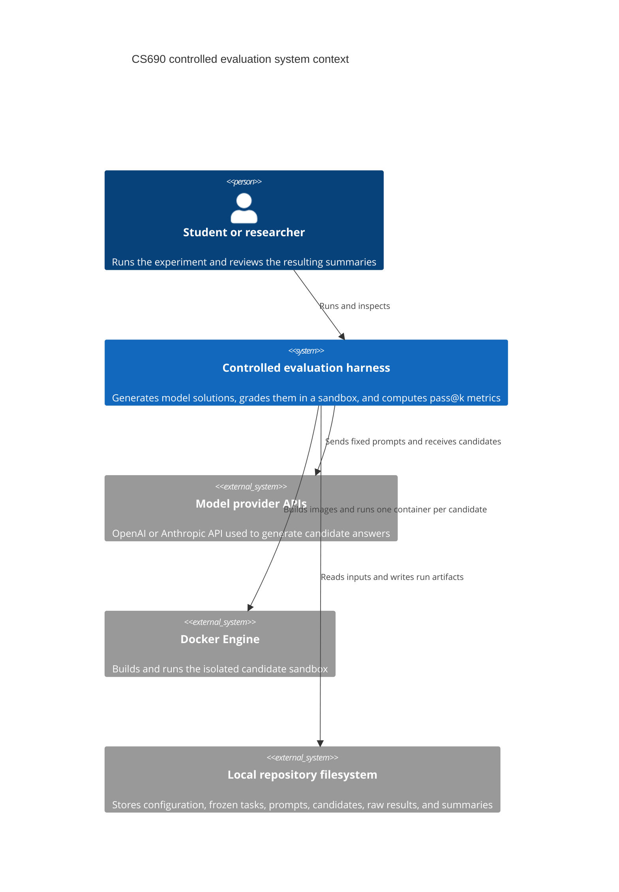
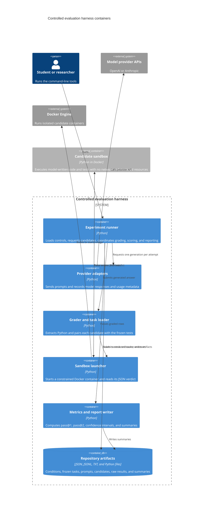

# C4 Context And Containers

The system boundary is the controlled evaluation harness. The model providers and Docker engine are external systems that the harness integrates with.

## System context

## Container view

