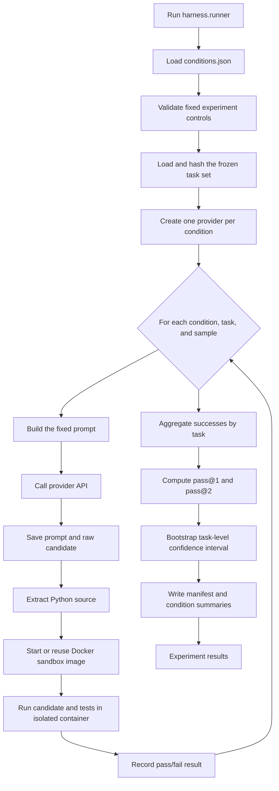

# Execution Flow

This flow shows the normal experiment path from the command-line entry point through model generation, sandbox grading, scoring, and report output.

```mermaid
flowchart TD
    A[Run harness.runner] --> B[Load conditions.json]
    B --> C[Validate fixed experiment controls]
    C --> D[Load and hash the frozen task set]
    D --> E[Create one provider per condition]
    E --> F{For each condition, task, and sample}
    F --> G[Build the fixed prompt]
    G --> H[Call provider API]
    H --> I[Save prompt and raw candidate]
    I --> J[Extract Python source]
    J --> K[Start or reuse Docker sandbox image]
    K --> L[Run candidate and tests in isolated container]
    L --> M[Record pass/fail result]
    M --> F
    F --> N[Aggregate successes by task]
    N --> O[Compute pass@1 and pass@2]
    O --> P[Bootstrap task-level confidence interval]
    P --> Q[Write manifest and condition summaries]
    Q --> R[Experiment results]
```
